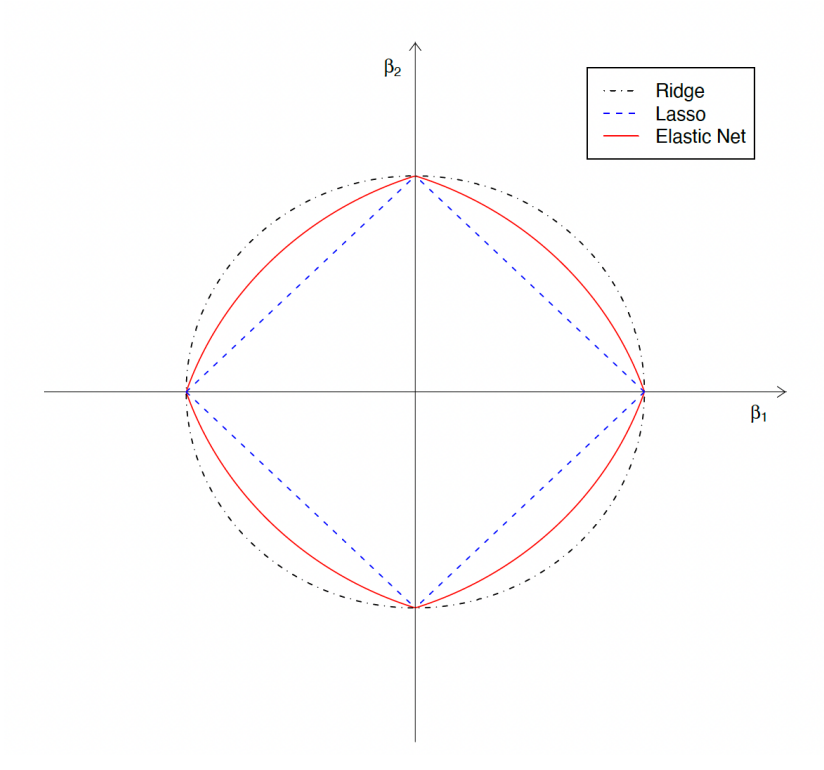

# Classfication and the Logistic Model

## Machine Learning Models
- Supervised learning
    - Input-output mapping (there are X and Y in the data)
    - most widely used in economic/finance-related research
    - Example: classification and regression --> the main focus of subjects this course covers.

- Unsupervised learning
    -No outputs, only inputs (there is only X in the data)
    - the goal is to find interesting patterns in the data and there are no desired outputs given a set of inputs
    - example: cluster analysis, topics extraction (textual analysis), etc.

- Reinforcement learning
    - involving an agent interacting with an environment, which provides reward signals
    - examples: robot navigation, gaming, etc.

## Supervised Learning
Some jargon we will often encounter in ML Literature
- The dataset: $D = \{y_t, X_t\}^T_{t - 1}$
- Denote $$f(X_t, \theta)$$ the mapping function, where $\theta$ is the vector of model parameters.
- Empirical Risk $R$ and Loss function $L$:
    - $R(D, \theta) = \frac{1}{T} \sum_{t = 1}^T L(y_t, f(x_t, \theta))$
    - Estimation/optimization/learning:
        $$\hat{\theta} = argmin_{\theta} R(D, \theta)$$
    - The most commonly used loss function is the mean squared error, but above we fit or predict a $\hat{Y}$ for given $Y$. For the OLS, the loss function is the mean squared error. 
    - Above, we show a more generalized loss function to fit to any model. 
    - We simply take the average of the loss function and minimize it.

## Classification
- Very often, the response variable is not a continuous numerical variable. For example, we want to estimate a stock's price is going ot move up or down the next trading day; or we are interested in predicting whether a client would default on a loan or not. In this case, response variable $Y \in \{0, 1\}$ (a binary variable).
- Given a feature vector $X$ and a binary response $Y$, the classification task is to build a function $C(X)$ that maps to the response variable $Y$.
- Often we are more interested in estimating the probabilities that $C(X)$ belongs to each category, i.e. $\{0, 1\}$.

### Example: Credit Card Default

#### Modelling Credit Card Default
Suppose
$$Y = \begin{cases}
   0 &\text{if } No \\
   1 &\text{if } Yes
\end{cases}$$

Can we simply perform a linear regression of $Y$ on $X$ and classify as 'Yes' if $\hat{Y} > 0.5$?
- To some extent, it does the job for classification since we can make a prediction on $Y$ given $X$.
- However, the sensitivity of a change in X to Y is the same along the real line (ideally, we want it to be more in the middle and less sensitive at two ends). Furthermore, we are likely to produce probabilities below zero and larger than 1. This is obviously not possible

Suppose we are using an OLS regression Model

## Logistic Regression
Let's denote $p(X) = P(Y = 1 | X)$ (probability of default given X) for convenience. Consider the model using 'balance' to predict 'default'. Logistic regression uses the form
$$p(X) = \frac{e^{\beta_0 + \beta_1 X}}{1 + e^{\beta_0 + \beta_1 X}}$$

This is sometimes also called a sigmoid function.

It is easy to see that the value of $p(X)$ is always restricted between 0 and 1 regardless of the values of $\beta_0$, $\beta_1$, and $X$. 

## Logistic Regression for Classification
Logistic regression is a better alternative for this task.

The orange marks indicate the response $Y$, either 0 or 1. Linear regression does not estimate $Pr(Y = 1 | X)$ well. Logistic regression does the job much better.

- You may think there is a connection between the logistic and OLS models.
- Rearranging the previous equation, we obtain
$$log(\frac{p(X)}{1 - p(X)}) = \beta_0 + \beta_1 X$$
We call this the _logit transformation_ of $p(X)$. Sometimes this is also known as the generalized linear regression model.
- We can use the 'fitglm' function from Matlab (setting 'distribution' parameter to 'binomial') to estimate a logistic model (more details in the tutorial).

## Evaluate Model Performance
- We may use various models to evaluate the relations between $X$ and $Y$, or we want to predict $Y$ given $X$. How do we decide which model performs best?
- From the OLS model, we learned that $R^2$ is a measure of goodness of fit. However, it is an in-sample measure. Usually, we are more interested in out-of-sample measures.
- Technically, we use in-sample data to estimate a model and obtain the model parameters. Then, we use out-of-sample to evaluate the performance of such estimated model.
- In econometric terminology, we call these data samples 'in-sample' and 'out-of-sample' data; whereas in machine learning, they are often referred to as 'training' and 'testing' samples.

### Confusion Matrix
- In case of binary classification problems, confusion matrices are commonly used to compare models.
After estimating the model using the training sample and obtained model parameters, we can then predict $Y$ given $X$ in the testing sample. The model would predict $\hat{Y}$, then we can compare $\hat{Y}$ with $Y$.
- Depending on the pairwise values between $Y$ and $\hat{Y}$, we have the following four types:

- Some important measures
    - True Positive Rate (TPR): $TPR = \frac{TP}{TP + FN}$
    - True Negative Rate (TNR): $TNR = \frac{TN}{TN + FP}$
    - False Discovery Rate (FDR): $FDR = \frac{FP}{FP + TP}$
    - Accuracy: $ACC = \frac{TP + TN}{P + N}$, which is essentially the true predictions over all the predictions.

## Example: Predict Bank Churners
- A bank wants to understand what caused customers to leave (i.e. customers stop transactions with an entity.)
- In the dataset, you are given three possible predictors.
- Use the logistic model and the OLS (as a benchmark) for predicting churners.
- We split the whole sample into training and testing samples. Using the training sample to evaluate a model while using the testing sample for gauging model accuracy.

### Histogram of Each Variable

# Model Selection and Best Subset Model
## OLS and Overfitting
- Suppose a linear model  $$y = \beta_0 + \beta_1 x_1 + \text{...} + \beta_p x_p + \epsilon$$
- If the number of explanatory variable $p$ is large, we often have an overfitting problem: poor performance for predicting out-of-sample data.
- Then, an important question would be: how do we select relevant $x$ to predict $y$ and how many.
- This is actually an important research subject in many research domains (econometrics/statistics/machine learning).
- There are many different approaches (we are going to cover more of them later in this course).

## Best Subset Model
- One approach to the model selection problem is the best subset model: if we identify a subset of the p predictors that best explain the response variable
- Two main tasks: which predictors and how many?
- We answer the above questions using the forward and backward selection algorithm.

## Math Recap: Hypothesis Testing and the P-Value
- Recall that, for instance using a t-test, we reject the null hypothesis  $H_0: \beta_k = 0 \text{ if } |\frac{\hat{\beta}_k}{s.e.(\hat{\beta}_k)}| > t_{1-\alpha/2}(T-K)$.
- The p-value responds to $\mathbb{P}(\beta_k \geq |\frac{\hat{\beta}_k}{s.e.(\hat{\beta}_k)}|)$

- Graphically,

## Best Subset Model 
### Forward Selection
- It begins with a model containing no predictors, and then adds predictors to the model, one-at-a-time, until all of the predictors are in the model.
- Specifically, at each step, use the p-value of the F-statistic to test models **with** a potential predictor at each step, where the null hypothesis is that the added predictor has a coefficient equal to zero.

### Backward Selection
- It begins with a more complex model, and then iteratively remove the least useful predictor, one-at-a-time.
- At each step, use the p-value to test models **without** a potential predictor at each step, where the null hypothesis is that the removed predictor has a coefficient equal to zero.

### Stepwise Regression Algorithm
1. We begin with the simplest model: a constant (the mean of y).
2. Examine a set of available predictors not in the model. If any of these predictors have p-values less than an entrance tolerance (for example 5% significance level), add the predictor with the **smallest** p-value and repeat this step; otherwise go to step 3 below.
3. If any of the available predictors in the model have p-values greater than an exit tolerance (that is, the hypothesis of a zero coefficient cannot be rejected), remove the predictor with the **largest** p-value and return to step 2; otherwise, end the process.

## Stepwise Selection
- The best subset selection method cannot be applied with very large p. Why?
- Best subset selection may also suffer from statistical problems when p is large: the larger the search space, the higher the chance of finding models that look good on the training data, even though they might not have good predictive power on testing samples.
- Estimation error accelerates along the number of steps taken to determine a final model. Therefore, with large p, estimation error will amount to a substantial level.

## Mean Squared Error
- To assess the accuracy of a classification model, we have introduced the confusion matrix for such a task. For regression models, MSE is often used for measuring the "closeness to truth."
- the MSE is defined as  $$\text{MSE} = \frac{1}{T}\sum_{i=1}^T (y_i - \hat{y}_i)^2$$
    where $\hat{y_i} = f(X_i, \hat{\theta})$
- You may have noticed that MSE is often used as the Empirical Risk for estimating a model. Why is this so?

## MSE and Bias-Variance Tradeoff
- From the definition of MSE, we have $E(\text{MSE}) = E(y_i - \hat{y_i})^2$
- Utilizing the property $E(X^2) = Var(X) + E(X)^2$, for any random variable X, we can show that [equation goes here]

## Bias-Variance Tradeoff
Our object is to minimize the bias and the variance, but often there is a trade-off between them:

# Penalized Regression Model

## Penalized Least Squares
A penalized least square estimator is defined as
$$\hat{\beta} = argmin_{\beta} \sum_{t = 1}^T (yt-\beta'x_t)^2 + \lambda \sum_{j = 1}^p p_{\lambda}(|\beta_j|)$$
where $x_t$ is a $p \times 1$ vector which stores $p$ predictors at time $t$. $\beta$ is a $p \times 1$ vector which is the parameter vector of interest.
- Penalized regression moels are often called shrinkage models, i.e. they shrink the parameters $\hat{\beta}$ towards zero.
- $p_{\lambda}(|\beta_j|)$ is a penalty function indexed by the regularization parameter $\lambda$.
- Different choices of $p_{\lambda}(|\beta_j|)$ lead to various estimators, e.g.
    - Ridge regression: $p_{\lambda}(|\beta_j|) = \lambda |\beta_j^2|$
    - Lasso regression: $p_{\lambda}(|\beta_j|) = \lambda |\beta_j|$
    - Elastic net: $p_{\lambda}(|\beta_j|) = \alpha \lambda |\beta_j|^2 + (1 - \alpha) \lambda |\beta_j|$
- $\lambda$ controls the intensity of the penalty. Therefore, influences the number of parameters included in the model (for some penalized models), which relates to model selection, which we will be talking about later on.
- If $\lambda = 0$, it penalizes all variables and shrinks them to zero, and no variables enter the model, if $\lambda = 0$ it is equivalent to OLS, i.e. no penalty/shrinkage applied.
- Penalized least squares estimators are commonly used in economic and finance related research. In the domain of economics & finance research, they are often called shrinkage/penalized estimators. Machine learning and computer science literature often refers to the same thing as "regularization."
- Substantial work has been done to reveal the statistical properties, such as their asymptotic distribution, penalized least squares estimators are less of a blac box, which is a common critique of ML models.

## Revisit the Bias-Variance Tradeoff
- Recall that MSE can be decomposed into bias and variance components
$$E(MSE) = \text{variance} + \text{bias}^2$$
- OLS estimator is BLUE (best linear unbiased estimator)
- Does that mean OLS achieves the smallesst MSE?
    - Yes, if we only consider all unbiased linear regression models (as implied by the GM assumptions)
    - No, if we allow a certain amount of bias in the estimator.

## Penalized Least Squares are Biased Models
- Recall that the parameter $\lambda$ controls shrinkage intensity
- If $\lambda = 0$, then there is no shrinkage applied --> equivalent to OLS --> unbiased model.
- if $\lambda > 0$, penalized least squares models are biased models --> the larger $\lambda$ is, the larger the bias.

## Motivation of the Penalized Least Squares
The origin of shrinkage: Bias-Variance trade-off

We try to minimize the MSE and the lambda. We try to find the minimum point on the black solid line and this choice of lambda becomes very critical. We will find out how to choose lambda ideally, later on.
- From the image above, we can see that the penalized least squares estimators are biased (considering $\lambda > 0$)
    - the bias grows along with the shrinkage intensity parameter $\lambda$
    - the variance decreases along with the shrinkage intensity parameter $\lambda$
    - at some level of $\lambda$ the penalized estimators achieve the smallest MSE (from the figure, the bottom of the U shaped curve).

## Ridge Regression
Hoerl and Kennard (1970) proposed ridge regression, which is a penalized least squares estimator.
- The ridge regression estimator is defined as follows:
$$\hat{\beta}_{\text{Ridge}} = \argmin_{\beta}(\sum_{t=1}^T (yt-\beta'x_t)^2 + \lambda \sum_{j = 1}^p \lambda |\beta_j|^2)$$
- This estimator **shrinks** estimated parameters towards zero (but not exactly zero) for redundant predictors.
- $\lambda$ is a hyper-parameter (in ML literature, they are often called a tuning parameter), which controls the shrinkage intensity.
- How to determine the value of $\lambda$ is crucial.
- Since the objective function is smooth (which means it is differentiable and has a unique minimum), we can easily solve the optimization problem and obtain
$$\hat{\beta}_{\text{Ridge}} = (X'X + \lambda I)^{-1}Y'y$$  
where $I$ is an Identity matrix.
- The format is similar to the OLS estimator, except that there is a shrinkage component ($\lambda I$) in the solution.
- Ridge regression is good for prediction (achieving smaller MSE than the OLS), since it is more robust to multicollinearity problems. But it is not good for variable selection. The purpose of the ridge regression model, is just to try to reduce the coefficients of our explanatory variables.They will go as close to zero as possible, but never reach it, so we will never be certain that any of our predictors are signal or noise. We treat the same, and this obviously means that for the purposes of "labeling" noise variables, ridge regression performs very poorly, because that's not its purpose.

The Ridge optimization problem can also be written as (duality):
$$\hat{\beta}_{\text{Ridge}} = \argmin_{\beta} \sum_{t=1}^T (yt-\beta'x_t)^2$$

subject to

$$\sum_{j=1}^p \beta_j^2 \leq c(\lambda)$$

- The optimization problem is equivalent to
    1. minimize the OLS objective function
    2. meanwhile, restricting the parameters smaller than a threshold value $c(\lambda)$
- $c(\lambda) > 0$ is a value determined by hyper-parameter $\lambda$. It is a monotonically decreasing function of $\lambda$, i.e. the larger (smaller) $\lambda$ is, the smaller (larger) $c(\lambda)$ will be.

### Geometric Interpretation

Above we see the solution path for $\lambda$. We see that as $\lambda$ increases, the solution gets closer and closer to zero. The graph shows how the ridge regression looks like in a simple case where we have two predictors.

- Considering a two-dimensional case, we only have two predictors. The coefficients are labeled as $\beta_1$ and $\beta_2$.
- The left-bottom circles represent the atomic norm of the penalty term
- The right-top circles represent the contours of the solution of the objective function without the penalty term.
- The radius of the circle representing the penalty term is equivalent to $c(\lambda)$.
When $\lambda$ is large, i.e. $c(\lambda)$ is small, the tangent point with the contours from the OLS estimator is closer to the origin.
- This tangent point determines the optimized solution. Therefore, a large $\lambda$ (i.e. higher shrinkage intensity, smaller value of $c(\lambda)$) results in $\beta_1$ and $\beta_2$ being close to zero.
- In othzer words, the Ridge estimator **shrinks** $\beta$ to zero. Thus, we call it the **shrinkage** estimator.
- when p, i.e. the number of predictors, is small, OLS does a good job
- When p is large, OLS is over-fitted, leading to poor performance out of sample.
- With large p, the Ridge estimator achieves smaller MSE by introducing bias into the estimator, leading to improved performance out of sample.
- However, although the Ridge estimator shrinks predictors' coefficients towards zero, it does not arrive at zero. Why? 

### The Ridge Path
The Ridge path is the function fo the estimated coefficients ($\hat{\beta}$) as a function of the shrinkage intensity parameter $\lambda$.

- Simulated data from a linear regression model with $p = 10$ covariates. Number of observations: $T = 100$.
- Both $X$ and $u$ come jointly from a normal distribution with mean zero and unit variance.
- The figure shows the Ridge estimates as a function of $\lambda$.
- Fact: the ridge path is continuous and the estimates go to zero only in the limit of $\lambda \rightarrow 0$.

If we zoom in on the right-bottom of the previous figure

All coefficients are getting closer to zero, but not exactly zero.

But what if $p>T$, where p is the number of parameters, and T is the number of observations?
Ridge regression still works

As you can see, if we zoom in on the right tail again, the betas get extremely close to zero, but are never equal:

### Choosing Lambda
- In general, there is no closed-form way of choosing $\lambda$. 
- Data driven methods are usually ued. 
- two commonly used approaches ate 1) information criterion and 2) cross-validation, which we explore further in the notebook for week 2.

#### Information Criterion
We try to achieve a balance between goodness-of-fit and parsimony. Typical information criteria used are
- $AIC = log(\hat{\sigma^2}(\lambda)) + df(\lambda)\times \frac{2}{T}$
- $BIC = log(\hat{\sigma^2}(\lambda)) + df(\lambda) \times \frac{log(T)}{T}$
- $HQIC = log(\hat{\sigma^2}(\lambda)) + df(\lambda) \times \frac{log log(T)}{T}$
where $df(\lambda)$ are the degrees of freedom associated with $\lambda$ and 
$$\sigma^2(\lambda) = \frac{1}{T - df(\lambda)} \sum_{t=1}^T(y_t - \hat{\beta_{\text{Ridge}}}(\lambda)'x_t)^2$$

#### Cross Validation
- The main method used in ML literature. It's data driven and is designed to minimize the MSE out of sample. 
- Generally, it divides the sample into sub-samples for training and validation purposes. 
We will cover this more formally later on.

# The LASSO Regression Model
## Motivation
- Why do we need LASSO? What key properties does the LASSO regression have, that the OLS and Ridge estimators lack?
- **Sparsity** - LASSO can perform sparse selection of a large number of predictors. it can pick up important predictors and shrink off unimportant ones.
- Sparse selection is vital in the big-data era. Big data is everywhere. Old methods face tremendous challenges when dealing with big data. (Why?) LASSO Provides one of the popular methods for modelling big data. 

## The LASSO Estimator: Tibshirani (1996)
- Some notation: for any vector $v \in R^p, ||v||_1 := |v_1| + |v_2| + \text{...} + |v_p|$ is the $l_1$ norm of vector $v$, and, $||v||_2 := (v_1^2 + v_2^2 + \text{...} + v_p^2)^{1/2}$ is the $l_2$ norm of vector $v$.
- Least Absolute Shrinkage and Selection Operator (LASSO):
$$\hat{\beta}_{\text{LASSO}} = argmin_{\beta} \frac{1}{2T}(\sum_{t = 1}^T (yt - \beta'x_t)^2 + \lambda \sum_{j = 1}^p |\beta_j|)$$
$$= argmin_{\beta} (\frac{1}{2T}||y - X\beta||_2^2 + \lambda ||\beta||_1)$$

## Some Important Properties of the LASSO Estimator
- Advantages
    - Shrinks the coefficients of unimportant predictors to zero, meaning it performs variable selection
    - Can efficiently handle high-dimensional data, even when $p ≫ T$.
    - Under some conditions can select the correct subset of relevant variables.

- Drawbacks
    - All shrinkage models are biased, therefore LASSO estimator is also biased.
        - However, by introducing bias, we can reduce the variance, which sometimes contributes to lower mean-squared error (MSE).
    - LASSO is adversely affected by multicollinearity issues.
    - Therefore, it can not be directly used to perform inference (although new developments in the ML literature are shedding new light on this issue.)

## The LASSO Regression: Geometric Interpretation

## Comparing LASSO and Ridge Regression
Why can LASSO perform variable selection, but Ridge regression can not?
The LASSO produces sparse models (some coefficients are zero) and automatically performs feature selection, whereas the Ridge regression shrinks all coefficients but keeps all coefficients non-zero. All features included in the model must be relevant/significant for this to be useful.

If you look at the geometric interpretation, when the contours of the loss function meet the constraint region, one coefficient becomes exactly equal to zero - notice this intersection only with LASSO and not with Ridge, consistent with the previous idea that Ridge shrinks all coefficients, but to non-zero values.

## Solving the LASSO Optimization Problem
- Unlike the Ridge objective function, which is smooth (and thus differentiable with respect to $\beta$), the LASSO objective function (i.e. the penalty term) is not smooth. Therefore, we don't have a closed-form solution. (What does this mean?)
- How to solve the LASSO optimization problem?
- What is $\partial ||\beta||_1$? $\rightarrow$ Consider: $f: R \rightarrow R, f(x) = |x|$
    - for $x \neq 0$, unique sub-gradient $\partial f(x) = sign(x)$
    - for $x = 0$, sub-gradient $\partial f(x) = [-1, 1]$

- Any LASSO solution $\hat{\beta(\lambda)}$ must satisfy the first order condition:
$$\frac{1}{T}X'[y - X\beta_{LASSO}(\lambda)] = \lambda \text{sign}$$
where $\text{sign} = (\text{sign}_1, \text{...}, \text{sign}_p)'$ and, for any $j = 1, \text{...}, p$:
$$\text{sign}_j = \begin{cases}
    1 & \text{if } \beta_{LASSO}(\lambda)_j > 0\\
    -1 & \text{if } \beta_{LASSO}(\lambda)_j < 0\\
    [-1, 1] & \text{if } \beta_{LASSO}(\lambda)_j = 0
\end{cases}$$
- $\text{sign} \in \partial||\hat{\beta}_{LASSO}(\lambda)||_1$ is a sub-gradient of $l_1$ norm of $\beta$ evaluated at $\hat{\beta}_{LASSO}(\lambda)$.

Therefore,
$$\frac{1}{T}X_j^{'}[y - X\beta_{LASSO}(\lambda)] = \lambda \text{sign} [\hat{\beta}_{LASSO, j}(\lambda)] \space \text{if} \space \hat{\beta}_{LASSO, j}(\lambda) \neq 0$$
$$\frac{1}{T}X_j^{'}[y - X \hat{\beta}_{LASSO}(\lambda)] \leq \lambda \space \text{if} \space \hat{\beta}_{LASSO, j}(\lambda) = 0$$

- It means the correlation between a predictor $X_j$ and the residuals $y - X \hat{\beta}_{LASSO}(\lambda)$ must exceed a certain minimum threshold $\lambda$ before it is included in the model.
- If this correlation is below $\lambda$, then $\hat{\beta}_{LASSO, j}(\lambda) = 0$

## Soft Thresholding Function
- For LASSO regression, we usually standardize $X$ (each column of $X$ has a zero mean and unit variance) to eliminate scaling problems. 
- If $p \leq T$ and $\frac{1}{T}X'X = I$, the LASSO estimator is the soft thresholding estimator:
$$\hat{\beta}_{LASSO, j} := S_{\lambda}(Z_j) = \begin{cases}
    Z_j - \lambda & \text{if } Z_j > \lambda\\
    0 & \text{if } |Z_j| \leq \lambda\\
    Z_j + \lambda & \text{if } Z_j < -\lambda
\end{cases}$$
where $Z_j = \frac{1}{T}X_j^{'}y$.
- Note that, in this case, $\frac{X_j y}{T}$ is the OLS estimator.

### Geometric Interpretation

## LASSO Regularization Path

When $\lambda$ increases, $\hat{\beta}$ decreases. But is this always true? No, as we can see the dark blue line slowly increases before decreasing all the way to zero. This can happen if there is a correlation between two correlated predictors with some explanatory power. If one of these correlated predictors with explanatory power is shrunk to zero, this explanatory power shifts to the other predictor(s). The game is about choosing lambda in order not to shrink too many predictors to zero, especially not ones with explanatory power! But if we shrink a variable with explanatory power, they don't go out without a fight!

- Simulated data from a linear regression model with $p = 10$ covariates. Number of observations $T = 5$
- Both $X$ and $u$ come jointly from a standard normal distribution
- The figure shows the LASSO estimates as a function of $\lambda$. 
- FACT 1: The LASSO path is piecewise linear
- FACT 2: if $\lambda \geq \frac{1}{T}||X'y||_{\inf}$ all LASSO estimates will be zero. Therefore $\lambda_{\text{max}} = \frac{1}{T}||X'y||_{\inf}$
- Note that LASSO estimates can increase as a function of $\lambda$ as we discussed above.

# Cross Validation and Bootstrap

## Choosing Parameter $\lambda$
- In both Ridge and LASSO regression models, the value of $\lambda$ determines the intensity of shrinkage level
- Therefore, it has direct impact on the estimated results. Also, it is a key element to determine the sparsity of the LASSO estimator.
- In general, there are no closed-form results for choosing $\lambda$.
- Data-driven methods are usually used.
- Grid of possible values for $\lambda: \lambda \in \{\lambda_1, \lambda_2, \text{...}, \lambda_n\}$
- Two commonly used approaches:
    - Information Criterion: such as AIC (Akaine Information Criterion) and BIC (Bayesian Information Criterion).
    $$\hat{\lambda} = argmin_{\lambda}[-\text{log likelihood} + \text{penalty}]$$
    - Cross Validation: main idea is to split samples into parts. Use one part to estimate the model and other part to evaluate the model estimated.

- Look at out-of-sample prediction error and choose $\lambda$ that provides good predictors in the mean squared error sense.
- A simple way is to divide the sample into two sub-samples: training (estimation) set and testing (validation) set
    - Estimate the parameters only on the training set.
    - Evaluate the model on the testing set
    - Choose $\lambda$ in order to minimize the mean squared forecast errors on the test set.
- However, the results are strongly dependent on the choice of the training/testing sample split.
- Solution: multiple splits (cross-validation).
- Define:
    - $V \in {1, \text{...}, T}$ is the set of indices of the observations in a given validation set (not used for estimation).
    - $T \in {1, \text{...}, T}$ is the set of indices of the observations in a given training set (used for estimation).
- For a choice of $T$ and $V$, define the cross-validation loss:
$$CV(\lambda; T, V) = \frac{1}{T_V} \sum_{t \in T_V} (y_t - x_t^{'}\hat{\beta}_{\text{Ridge}}(\lambda)^{T})^2$$
where $\hat{\beta}_{\text{Ridge}}(\lambda)^{T}$ is the Ridge estimator computed on the training set $T$ and $T_V$ is the number of observations in the validation set.

- Let $V = {V_1, V_2, \text{...}, V_B}$ a collection of B validation sets and let $T = {T_1, T_23, \text{...}, T_B}$ be the respective training sets.
- Define the average loss over the validation sets as:
$$CV(\lambda) = \frac{1}{B} \sum_{b = 1}^B CV(\lambda; T_b, V_b)$$
- The idea of cross-validation is to select $\lambda$ such that
$$\hat{\lambda} = argmin_{\lambda} CV(\lambda)$$

## Cross-Validation
How do we determine the value of B and the train/test split?
- B-Fold CV (Sometimes called K-Fold CV): the sample is randomly partitioned into B disjoint subsamples with approximately the same number of observations. 
$$
\begin{align*}
\text{1st run} & \quad \bullet\circ\circ\circ\circ\circ \rightarrow \text{MSE}_1 \\
\text{2nd run} & \quad \circ\bullet\circ\circ\circ\circ \rightarrow \text{MSE}_2 \\
\text{3rd run} & \quad \circ\circ\bullet\circ\circ\circ \rightarrow \text{MSE}_3 \\
\text{4th run} & \quad \circ\circ\circ\bullet\circ\circ \rightarrow \text{MSE}_4 \\
\text{5th run} & \quad \circ\circ\circ\circ\bullet\circ \rightarrow \text{MSE}_5 \\
\text{6th run} & \quad \circ\circ\circ\circ\circ\bullet \rightarrow \text{MSE}_6 \\
& \qquad\qquad\qquad \downarrow \\
& \text{MSE} = \frac{1}{6}\sum_{i=1}^6 \text{MSE}_i
\end{align*}
$$
- Of all the lambda we tried, we will choose the one which gave us the lowest MSE of all trials.

### A Special Case of B-Fold CV:
- If we set $B = T$, then it yields T-fold CV, often referred to as **Leave One Out Cross Validation** (LOOCV).
- LOOCV is sometimes useful, but typically doesn't _shake up_ the data enough. The estimates from each fold are highly correlated, and hence their average can have high variance.
- If the sample size is large, LOOCV can be computationally expensive. 
- Typically, we choose $B = 5$ or $B = 10$.

## The Bootstrap
- The bootstrap is a flexible and powerful statistical tool that can be used to quantify the uncertainty associated with a given estimator or statistical learning method.
- For example, it can provide an estimate of the standard error of a coefficient, or a confidence interval for that coeficient.

### Example
- Suppose that we wish to invest a fixed sum of money in two financial assets that yield returns of X and Y, respectively, where X and Y are random quantities.
- We will invest a fraction $\alpha$ of our money in X and will invest the remaining $1 - \alpha$ in Y.
- We wish to choose $\alpha$ to minimize the total risk, or variance, of our investment. In other words, we want to minimize $Var(\alpha X + (1-\alpha)Y)$.
- One can show that the value that minimizes the risk is given by
$$\alpha = \frac{Var(Y) - Cov(X, Y)}{Var(X) + Var(Y) - 2Cov(X, Y)}$$
- However, the values of $Var(X)$, $Var(Y)$, and $Cov(X, Y)$ are unknown.
- We can compute estimates for these quantities, $\hat{Var(X)}$, $\hat{Var(Y)}$, $\hat{Cov(X, Y)}$, using a data set that contains measurements for X and Y.
- We can then estimate the value of $\alpha$ that minimize the variance of our investment using
$$\alpha = \frac{\hat{Var(Y)} - \hat{Cov(X, Y)}}{\hat{Var(X)} + \hat{Var(Y)} - \hat{2Cov(X, Y)}}$$

- To estimate the standard deviation of $\hat{\alpha}$, we repeated the process of simulating 100 paired observations fo X and Y, and estimating $\alpha$ 1000 times.
- We thereby obtained 1000 estimates for $\alpha$, which we can call $\hat{\alpha}_1, \hat{\alpha}_2,\hat{\alpha}_3, \text{...}, \hat{\alpha}_1000$

- The left-hand panel of the figure displays a histogram of the resulting estimates.
- For these simulates the parameters were set to $Var(X) = 1$ $Var(Y) = 1.25$, and $Cov(X, Y) = 0.5$ so we know that the true value of $\alpha$ is 0.6 (indicated by the red line).
- The mean over all 1000 estimates for $\alpha$ is
$$\bar{\alpha} = \frac{1}{1000}\sum_{i = 1}^{1000} \hat{\alpha}_r = 0.5996$$
  very close to $\alpha = 0.6$, and the standard deviation of the estimates is
  $$\sqrt{\frac{1}{1000 - 1}\sum_{i = 1}^{1000} (\hat{\alpha}_r - \bar{\alpha})^2} = 0.083$$
- This gives us a very good idea of the accuracy of $\hat{\alpha}$: $\text{S.E.}(\hat{\alpha}) = 0.083$

## The Bootstrap: Now Back to the Real World
- The procedure outlined above cannot be applied, because for real data we cannot observe the population. Therefore, cannot generate new samples from the population.
- However, the bootstrap approach allows us to use a computer to mimic the process of obtaining new data sets. Rather than repeatedly obtaining independent data sets from the population, we instead obtain distinct datasets by repeatedly sampling observations from the (observable) original sample with replacement.
- Each of these "bootstrap" datasets is created by sampling with replacement, and is the same size as our original dataset. As a result, some observations may appear more than once in a given bootstrap dataset and some not at all.

### Example with just 3 observations

Each bootstrap sampling contains 3 observations (same as the original dataset), sampled with replacement. Each bootstrap set is used to obtain an estimate of $\alpha$.
- Denoting the first bootstrap dataset by $Z^{*1}$. We use $Z^{*1}$ to produce a new bootstrap estimate for $\alpha$, we call it $\hat{\alpha}^{*1}$.
- This procedure is repeated B times for some large value of B. So we have B bootstrap datasets $Z^{*1}, Z^{*2}, \text{...}, Z^{*B}$ with corresponding estimates $\hat{\alpha}^{*1}, \hat{\alpha}^{*2}, \text{...}, \hat{\alpha}^{*B}$.
- We estimate the standard error of these bootstrap estimates using the formula
  $$\text{S.E.}(\hat{\alpha}) = \sqrt{\frac{1}{B - 1}\sum_{b = 1}^B (\hat{\alpha}^{*b} - \bar{\alpha})^2}$$.
- This can be used to estimate the standard error of $\hat{\alpha}$ estimated from the original data set.

## The Bootstrap in General
- In more complex data situations, figuring out the appropriate way to generate bootstrap samples can require some thought.
- For example, if the data is a time series, we can't simply sample the observations with replacement. 
- We can instead create blocks of consecutive observations and sample those blocks with replacement. Thus, by doing so, it preserves the auto-correlation within the dataset.

# Beyond the LASSO: the Elatic Net and Other "Relatives"
## Post LASSO Inference
- LASSO is a powerful and popular tool to deal with high-dimensional big data. It can learn weak predictors and shrink them to zero.
- However, LASSO is a biased estimator $\rightarrow$ not good for inference.
- Often, making inferences is an important task in economic and financial research questions, for example, among some set of predictors, is the stock's past performance significant in predicting the stock's returns?
- A simple solution: post LASSO inference.
  - Two step procedure: first, run a LASSO regression with many predictors. Second, the LASSO estimator will only select a small number of surviving predictors (i.e. predictors which have not been shrunk to zero). Next, we run the surviving predictors to run an OLS regression (which is in a low dimensional world now) and finally, perform inference on the last OLS regression step.
  - Potential drawbacks?
  - Our second step is dependent on the first step: variable selection results, yet, we are not certain that the first step LASSO selection has correctly selected all true explanatory variables.
  - Can we do better than post LASSO OLS inference?

## Double LASSO Selection Inference
This is also known as "double machine learning", a relatively recent ML innovation and active research area.
- Reference: "Double/debiased machine learning for treatment and structural parameters", Chernozhukov et al. (2018), Econometrics Journal.
- Setup: you want to draw inference on a small number of explanatory variables on the causal effect to the response variable, while having a large number of controlling variables.
- Note: one can simply run an OLS regression on this small number of explanatory variable of primary interest while ignoring the high dimensional controlling variables $\rightarrow$ you will have omitted variable bias in your estimator $\rightarrow$ double LASSO selection procedure will overcome the "omitted variable bias".
- Procedure:
  - Divide all explanatory variables into two groups, put the small number of variables of prime interest into group f while putting the remaining variables in group g as controlling variables. Note that f is low dimensional while g is high dimensional.
  - Run a LASSO regression with y (response variable) on all variables in group g, select a small number of survival variables and put them in a set, call it $g_1$.
  - Run a LASSO regression with each variables in group f on all variables in group g, collect all surviving variables in a set, call it $g_2$.
  - Run OLS regressin with y on the set of variables that is the union of $f$, $g_1$, and $g_2$. then, we can perform inference on the last OLS regression step on variables in $f$.

## LASSO with Highly Correlated Variables
- Another drawback of the LASSO estimator is that when predictors are correlated, LASSO tends to perform poorly: selection of correlated predictors are unstable and therefore your estimations are very volatile.
- What to do?

[He does a simulation in the slides at this point, but this excluded for brevity.]

## Simulation: Conclusions
- LASSO estimator produces noisy estimation when predictors are correlated, particularly for useful predictors.
- LASSO estimator does a good job to shrink off useless predictors, even when factors are highly correlated.
- When predictors are uncorrelated, LASSO estimation is stable (low variance), but biased towards zero.
- When N is larger (closer to asymptotical level), estimation error becomes smaller.

## The Elastic Net (EN)
- Motivation: to alleviate the problems of LASSO estimator caused by correlated predictors
- The EN estimator is defined as
$$\hat{\beta}_{EN} = arg\min_{\beta}[||y - X \beta||_2^2 + \alpha \lambda ||\beta||_1 + (1-\alpha) \lambda ||\beta||_2^2]$$
where $0 < \alpha < 1$
- If $\alpha = 1$, EN becomes LASSO.

## Geometry of the EN

## Geometric Interpretation
Why is EN better than LASSO with correlated predictors? No edges!

[He performs a Monte Carlo simulation in the slides, but this is excluded for brevity.]

