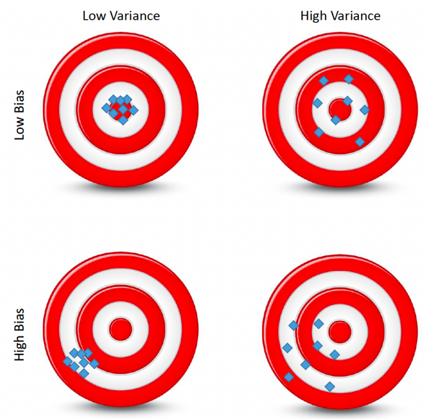

# Model Selection and Best Subset Model
## OLS and Overfitting
- Suppose a linear model  $$y = \beta_0 + \beta_1 x_1 + \text{...} + \beta_p x_p + \epsilon$$
- If the number of explanatory variable $p$ is large, we often have an overfitting problem: poor performance for predicting out-of-sample data.
- Then, an important question would be: how do we select relevant $x$ to predict $y$ and how many.
- This is actually an important research subject in many research domains (econometrics/statistics/machine learning).
- There are many different approaches (we are going to cover more of them later in this course).

## Best Subset Model
- One approach to the model selection problem is the best subset model: if we identify a subset of the p predictors that best explain the response variable
- Two main tasks: which predictors and how many?
- We answer the above questions using the forward and backward selection algorithm.

## Math Recap: Hypothesis Testing and the P-Value
- Recall that, for instance using a t-test, we reject the null hypothesis  $H_0: \beta_k = 0 \text{ if } |\frac{\hat{\beta}_k}{s.e.(\hat{\beta}_k)}| > t_{1-\alpha/2}(T-K)$.
- The p-value responds to $\mathbb{P}(\beta_k \geq |\frac{\hat{\beta}_k}{s.e.(\hat{\beta}_k)}|)$

- Graphically,

## Best Subset Model 
### Forward Selection
- It begins with a model containing no predictors, and then adds predictors to the model, one-at-a-time, until all of the predictors are in the model.
- Specifically, at each step, use the p-value of the F-statistic to test models **with** a potential predictor at each step, where the null hypothesis is that the added predictor has a coefficient equal to zero.

### Backward Selection
- It begins with a more complex model, and then iteratively remove the least useful predictor, one-at-a-time.
- At each step, use the p-value to test models **without** a potential predictor at each step, where the null hypothesis is that the removed predictor has a coefficient equal to zero.

### Stepwise Regression Algorithm
1. We begin with the simplest model: a constant (the mean of y).
2. Examine a set of available predictors not in the model. If any of these predictors have p-values less than an entrance tolerance (for example 5% significance level), add the predictor with the **smallest** p-value and repeat this step; otherwise go to step 3 below.
3. If any of the available predictors in the model have p-values greater than an exit tolerance (that is, the hypothesis of a zero coefficient cannot be rejected), remove the predictor with the **largest** p-value and return to step 2; otherwise, end the process.

## Stepwise Selection
- The best subset selection method cannot be applied with very large p. Why?
- Best subset selection may also suffer from statistical problems when p is large: the larger the search space, the higher the chance of finding models that look good on the training data, even though they might not have good predictive power on testing samples.
- Estimation error accelerates along the number of steps taken to determine a final model. Therefore, with large p, estimation error will amount to a substantial level.

## Mean Squared Error
- To assess the accuracy of a classification model, we have introduced the confusion matrix for such a task. For regression models, MSE is often used for measuring the "closeness to truth."
- the MSE is defined as  $$\text{MSE} = \frac{1}{T}\sum_{i=1}^T (y_i - \hat{y}_i)^2$$
    where $\hat{y_i} = f(X_i, \hat{\theta})$
- You may have noticed that MSE is often used as the Empirical Risk for estimating a model. Why is this so?

## MSE and Bias-Variance Tradeoff
- From the definition of MSE, we have $E(\text{MSE}) = E(y_i - \hat{y_i})^2$
- Utilizing the property $E(X^2) = Var(X) + E(X)^2$, for any random variable X, we can show that [equation goes here]

## Bias-Variance Tradeoff
Our object is to minimize the bias and the variance, but often there is a trade-off between them:
