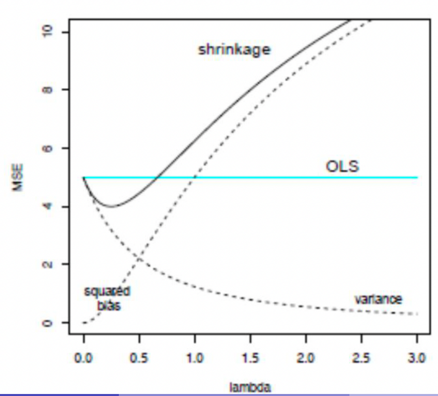
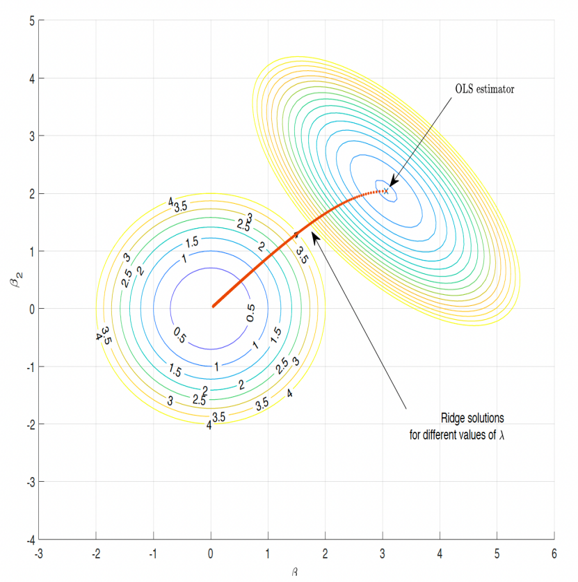
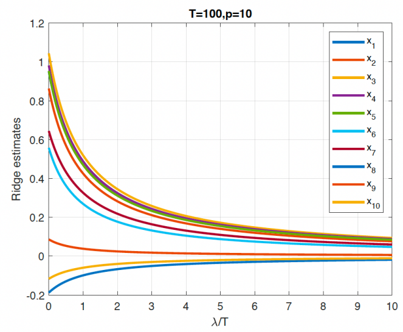
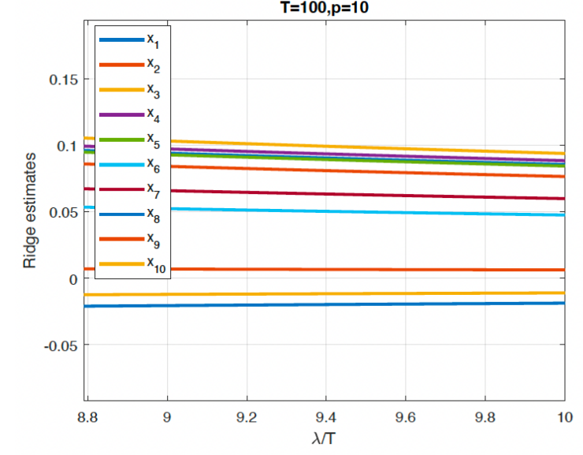
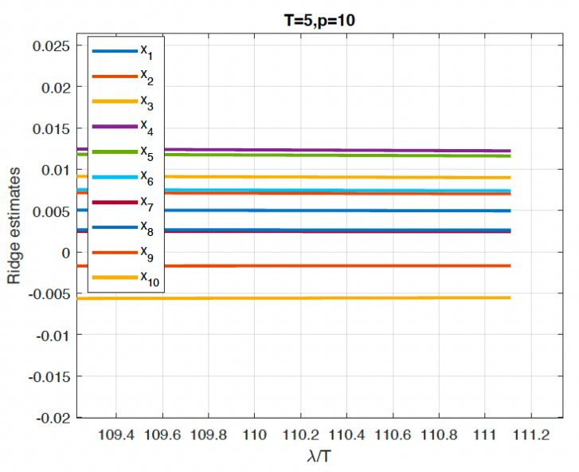

# Penalized Regression Model

## Penalized Least Squares
A penalized least square estimator is defined as
$$\hat{\beta} = argmin_{\beta} \sum_{t = 1}^T (yt-\beta'x_t)^2 + \lambda \sum_{j = 1}^p p_{\lambda}(|\beta_j|)$$
where $x_t$ is a $p \times 1$ vector which stores $p$ predictors at time $t$. $\beta$ is a $p \times 1$ vector which is the parameter vector of interest.
- Penalized regression moels are often called shrinkage models, i.e. they shrink the parameters $\hat{\beta}$ towards zero.
- $p_{\lambda}(|\beta_j|)$ is a penalty function indexed by the regularization parameter $\lambda$.
- Different choices of $p_{\lambda}(|\beta_j|)$ lead to various estimators, e.g.
    - Ridge regression: $p_{\lambda}(|\beta_j|) = \lambda |\beta_j^2|$
    - Lasso regression: $p_{\lambda}(|\beta_j|) = \lambda |\beta_j|$
    - Elastic net: $p_{\lambda}(|\beta_j|) = \alpha \lambda |\beta_j|^2 + (1 - \alpha) \lambda |\beta_j|$
- $\lambda$ controls the intensity of the penalty. Therefore, influences the number of parameters included in the model (for some penalized models), which relates to model selection, which we will be talking about later on.
- If $\lambda = 0$, it penalizes all variables and shrinks them to zero, and no variables enter the model, if $\lambda = 0$ it is equivalent to OLS, i.e. no penalty/shrinkage applied.
- Penalized least squares estimators are commonly used in economic and finance related research. In the domain of economics & finance research, they are often called shrinkage/penalized estimators. Machine learning and computer science literature often refers to the same thing as "regularization."
- Substantial work has been done to reveal the statistical properties, such as their asymptotic distribution, penalized least squares estimators are less of a blac box, which is a common critique of ML models.

## Revisit the Bias-Variance Tradeoff
- Recall that MSE can be decomposed into bias and variance components
$$E(MSE) = \text{variance} + \text{bias}^2$$
- OLS estimator is BLUE (best linear unbiased estimator)
- Does that mean OLS achieves the smallesst MSE?
    - Yes, if we only consider all unbiased linear regression models (as implied by the GM assumptions)
    - No, if we allow a certain amount of bias in the estimator.

## Penalized Least Squares are Biased Models
- Recall that the parameter $\lambda$ controls shrinkage intensity
- If $\lambda = 0$, then there is no shrinkage applied --> equivalent to OLS --> unbiased model.
- if $\lambda > 0$, penalized least squares models are biased models --> the larger $\lambda$ is, the larger the bias.

## Motivation of the Penalized Least Squares
The origin of shrinkage: Bias-Variance trade-off

We try to minimize the MSE and the lambda. We try to find the minimum point on the black solid line and this choice of lambda becomes very critical. We will find out how to choose lambda ideally, later on.
- From the image above, we can see that the penalized least squares estimators are biased (considering $\lambda > 0$)
    - the bias grows along with the shrinkage intensity parameter $\lambda$
    - the variance decreases along with the shrinkage intensity parameter $\lambda$
    - at some level of $\lambda$ the penalized estimators achieve the smallest MSE (from the figure, the bottom of the U shaped curve).

## Ridge Regression
Hoerl and Kennard (1970) proposed ridge regression, which is a penalized least squares estimator.
- The ridge regression estimator is defined as follows:
$$\hat{\beta}_{\text{Ridge}} = \argmin_{\beta}(\sum_{t=1}^T (yt-\beta'x_t)^2 + \lambda \sum_{j = 1}^p \lambda |\beta_j|^2)$$
- This estimator **shrinks** estimated parameters towards zero (but not exactly zero) for redundant predictors.
- $\lambda$ is a hyper-parameter (in ML literature, they are often called a tuning parameter), which controls the shrinkage intensity.
- How to determine the value of $\lambda$ is crucial.
- Since the objective function is smooth (which means it is differentiable and has a unique minimum), we can easily solve the optimization problem and obtain
$$\hat{\beta}_{\text{Ridge}} = (X'X + \lambda I)^{-1}Y'y$$  
where $I$ is an Identity matrix.
- The format is similar to the OLS estimator, except that there is a shrinkage component ($\lambda I$) in the solution.
- Ridge regression is good for prediction (achieving smaller MSE than the OLS), since it is more robust to multicollinearity problems. But it is not good for variable selection. The purpose of the ridge regression model, is just to try to reduce the coefficients of our explanatory variables.They will go as close to zero as possible, but never reach it, so we will never be certain that any of our predictors are signal or noise. We treat the same, and this obviously means that for the purposes of "labeling" noise variables, ridge regression performs very poorly, because that's not its purpose.

The Ridge optimization problem can also be written as (duality):
$$\hat{\beta}_{\text{Ridge}} = \argmin_{\beta} \sum_{t=1}^T (yt-\beta'x_t)^2$$

subject to

$$\sum_{j=1}^p \beta_j^2 \leq c(\lambda)$$

- The optimization problem is equivalent to
    1. minimize the OLS objective function
    2. meanwhile, restricting the parameters smaller than a threshold value $c(\lambda)$
- $c(\lambda) > 0$ is a value determined by hyper-parameter $\lambda$. It is a monotonically decreasing function of $\lambda$, i.e. the larger (smaller) $\lambda$ is, the smaller (larger) $c(\lambda)$ will be.

### Geometric Interpretation

Above we see the solution path for $\lambda$. We see that as $\lambda$ increases, the solution gets closer and closer to zero. The graph shows how the ridge regression looks like in a simple case where we have two predictors.

- Considering a two-dimensional case, we only have two predictors. The coefficients are labeled as $\beta_1$ and $\beta_2$.
- The left-bottom circles represent the atomic norm of the penalty term
- The right-top circles represent the contours of the solution of the objective function without the penalty term.
- The radius of the circle representing the penalty term is equivalent to $c(\lambda)$.
When $\lambda$ is large, i.e. $c(\lambda)$ is small, the tangent point with the contours from the OLS estimator is closer to the origin.
- This tangent point determines the optimized solution. Therefore, a large $\lambda$ (i.e. higher shrinkage intensity, smaller value of $c(\lambda)$) results in $\beta_1$ and $\beta_2$ being close to zero.
- In othzer words, the Ridge estimator **shrinks** $\beta$ to zero. Thus, we call it the **shrinkage** estimator.
- when p, i.e. the number of predictors, is small, OLS does a good job
- When p is large, OLS is over-fitted, leading to poor performance out of sample.
- With large p, the Ridge estimator achieves smaller MSE by introducing bias into the estimator, leading to improved performance out of sample.
- However, although the Ridge estimator shrinks predictors' coefficients towards zero, it does not arrive at zero. Why? 

### The Ridge Path
The Ridge path is the function fo the estimated coefficients ($\hat{\beta}$) as a function of the shrinkage intensity parameter $\lambda$.

- Simulated data from a linear regression model with $p = 10$ covariates. Number of observations: $T = 100$.
- Both $X$ and $u$ come jointly from a normal distribution with mean zero and unit variance.
- The figure shows the Ridge estimates as a function of $\lambda$.
- Fact: the ridge path is continuous and the estimates go to zero only in the limit of $\lambda \rightarrow 0$.

If we zoom in on the right-bottom of the previous figure

All coefficients are getting closer to zero, but not exactly zero.

But what if $p>T$, where p is the number of parameters, and T is the number of observations?
Ridge regression still works

As you can see, if we zoom in on the right tail again, the betas get extremely close to zero, but are never equal:

### Choosing Lambda
- In general, there is no closed-form way of choosing $\lambda$. 
- Data driven methods are usually ued. 
- two commonly used approaches ate 1) information criterion and 2) cross-validation, which we explore further in the notebook for week 2.

#### Information Criterion
We try to achieve a balance between goodness-of-fit and parsimony. Typical information criteria used are
- $AIC = log(\hat{\sigma^2}(\lambda)) + df(\lambda)\times \frac{2}{T}$
- $BIC = log(\hat{\sigma^2}(\lambda)) + df(\lambda) \times \frac{log(T)}{T}$
- $HQIC = log(\hat{\sigma^2}(\lambda)) + df(\lambda) \times \frac{log log(T)}{T}$
where $df(\lambda)$ are the degrees of freedom associated with $\lambda$ and 
$$\sigma^2(\lambda) = \frac{1}{T - df(\lambda)} \sum_{t=1}^T(y_t - \hat{\beta_{\text{Ridge}}}(\lambda)'x_t)^2$$

#### Cross Validation
- The main method used in ML literature. It's data driven and is designed to minimize the MSE out of sample. 
- Generally, it divides the sample into sub-samples for training and validation purposes. 
We will cover this more formally later on.
