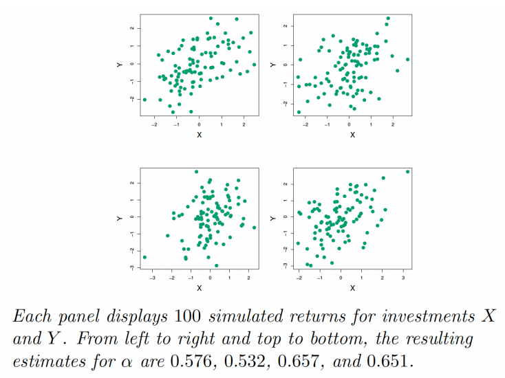
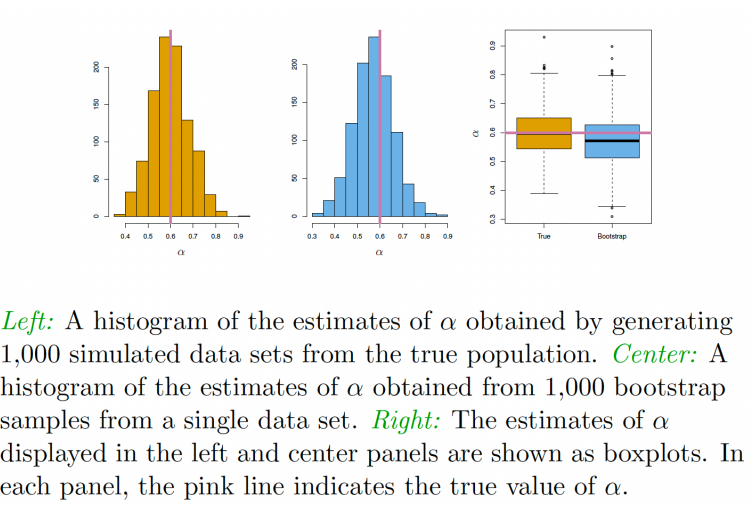

# Cross Validationa and Bootstrap

## Choosing Parameter $\lambda$
- In both Ridge and LASSO regression models, the value of $\lambda$ determines the intensity of shrinkage level
- Therefore, it has direct impact on the estimated results. Also, it is a key element to determine the sparsity of the LASSO estimator.
- In general, there are no closed-form results for choosing $\lambda$.
- Data-driven methods are usually used.
- Grid of possible values for $\lambda: \lambda \in \{\lambda_1, \lambda_2, \text{...}, \lambda_n\}$
- Two commonly used approaches:
    - Information Criterion: such as AIC (Akaine Information Criterion) and BIC (Bayesian Information Criterion).
    $$\hat{\lambda} = argmin_{\lambda}[-\text{log likelihood} + \text{penalty}]$$
    - Cross Validation: main idea is to split samples into parts. Use one part to estimate the model and other part to evaluate the model estimated.

- Look at out-of-sample prediction error and choose $\lambda$ that provides good predictors in the mean squared error sense.
- A simple way is to divide the sample into two sub-samples: training (estimation) set and testing (validation) set
    - Estimate the parameters only on the training set.
    - Evaluate the model on the testing set
    - Choose $\lambda$ in order to minimize the mean squared forecast errors on the test set.
- However, the results are strongly dependent on the choice of the training/testing sample split.
- Solution: multiple splits (cross-validation).
- Define:
    - $V \in {1, \text{...}, T}$ is the set of indices of the observations in a given validation set (not used for estimation).
    - $T \in {1, \text{...}, T}$ is the set of indices of the observations in a given training set (used for estimation).
- For a choice of $T$ and $V$, define the cross-validation loss:
$$CV(\lambda; T, V) = \frac{1}{T_V} \sum_{t \in T_V} (y_t - x_t^{'}\hat{\beta}_{\text{Ridge}}(\lambda)^{T})^2$$
where $\hat{\beta}_{\text{Ridge}}(\lambda)^{T}$ is the Ridge estimator computed on the training set $T$ and $T_V$ is the number of observations in the validation set.

- Let $V = {V_1, V_2, \text{...}, V_B}$ a collection of B validation sets and let $T = {T_1, T_23, \text{...}, T_B}$ be the respective training sets.
- Define the average loss over the validation sets as:
$$CV(\lambda) = \frac{1}{B} \sum_{b = 1}^B CV(\lambda; T_b, V_b)$$
- The idea of cross-validation is to select $\lambda$ such that
$$\hat{\lambda} = argmin_{\lambda} CV(\lambda)$$

## Cross-Validation
How do we determine the value of B and the train/test split?
- B-Fold CV (Sometimes called K-Fold CV): the sample is randomly partitioned into B disjoint subsamples with approximately the same number of observations. 
$$
\begin{align*}
\text{1st run} & \quad \bullet\circ\circ\circ\circ\circ \rightarrow \text{MSE}_1 \\
\text{2nd run} & \quad \circ\bullet\circ\circ\circ\circ \rightarrow \text{MSE}_2 \\
\text{3rd run} & \quad \circ\circ\bullet\circ\circ\circ \rightarrow \text{MSE}_3 \\
\text{4th run} & \quad \circ\circ\circ\bullet\circ\circ \rightarrow \text{MSE}_4 \\
\text{5th run} & \quad \circ\circ\circ\circ\bullet\circ \rightarrow \text{MSE}_5 \\
\text{6th run} & \quad \circ\circ\circ\circ\circ\bullet \rightarrow \text{MSE}_6 \\
& \qquad\qquad\qquad \downarrow \\
& \text{MSE} = \frac{1}{6}\sum_{i=1}^6 \text{MSE}_i
\end{align*}
$$
- Of all the lambda we tried, we will choose the one which gave us the lowest MSE of all trials.

### A Special Case of B-Fold CV:
- If we set $B = T$, then it yields T-fold CV, often referred to as **Leave One Out Cross Validation** (LOOCV).
- LOOCV is sometimes useful, but typically doesn't _shake up_ the data enough. The estimates from each fold are highly correlated, and hence their average can have high variance.
- If the sample size is large, LOOCV can be computationally expensive. 
- Typically, we choose $B = 5$ or $B = 10$.

## The Bootstrap
- The bootstrap is a flexible and powerful statistical tool that can be used to quantify the uncertainty associated with a given estimator or statistical learning method.
- For example, it can provide an estimate of the standard error of a coefficient, or a confidence interval for that coeficient.

### Example
- Suppose that we wish to invest a fixed sum of money in two financial assets that yield returns of X and Y, respectively, where X and Y are random quantities.
- We will invest a fraction $\alpha$ of our money in X and will invest the remaining $1 - \alpha$ in Y.
- We wish to choose $\alpha$ to minimize the total risk, or variance, of our investment. In other words, we want to minimize $Var(\alpha X + (1-\alpha)Y)$.
- One can show that the value that minimizes the risk is given by
$$\alpha = \frac{Var(Y) - Cov(X, Y)}{Var(X) + Var(Y) - 2Cov(X, Y)}$$
- However, the values of $Var(X)$, $Var(Y)$, and $Cov(X, Y)$ are unknown.
- We can compute estimates for these quantities, $\hat{Var(X)}$, $\hat{Var(Y)}$, $\hat{Cov(X, Y)}$, using a data set that contains measurements for X and Y.
- We can then estimate the value of $\alpha$ that minimize the variance of our investment using
$$\alpha = \frac{\hat{Var(Y)} - \hat{Cov(X, Y)}}{\hat{Var(X)} + \hat{Var(Y)} - \hat{2Cov(X, Y)}}$$

- To estimate the standard deviation of $\hat{\alpha}$, we repeated the process of simulating 100 paired observations fo X and Y, and estimating $\alpha$ 1000 times.
- We thereby obtained 1000 estimates for $\alpha$, which we can call $\hat{\alpha}_1, \hat{\alpha}_2,\hat{\alpha}_3, \text{...}, \hat{\alpha}_1000$

- The left-hand panel of the figure displays a histogram of the resulting estimates.
- For these simulates the parameters were set to $Var(X) = 1$ $Var(Y) = 1.25$, and $Cov(X, Y) = 0.5$ so we know that the true value of $\alpha$ is 0.6 (indicated by the red line).

