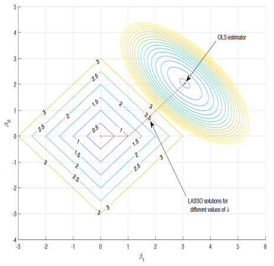
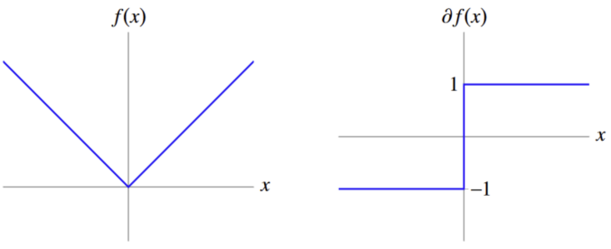
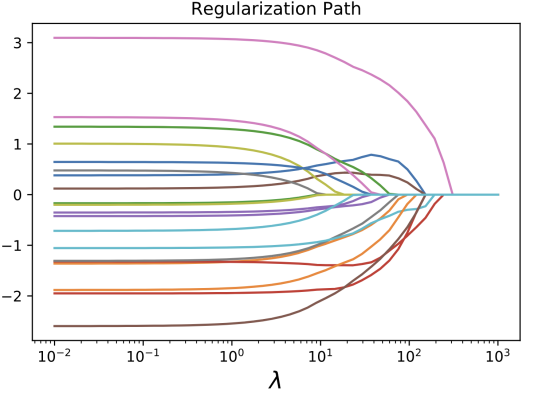
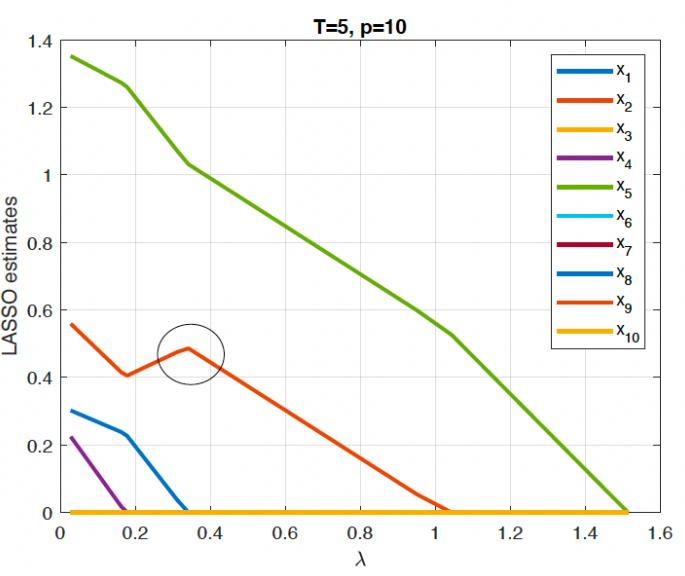

# The LASSO Regression Model
## Motivation
- Why do we need LASSO? What key properties does the LASSO regression have, that the OLS and Ridge estimators lack?
- **Sparsity** - LASSO can perform sparse selection of a large number of predictors. it can pick up important predictors and shrink off unimportant ones.
- Sparse selection is vital in the big-data era. Big data is everywhere. Old methods face tremendous challenges when dealing with big data. (Why?) LASSO Provides one of the popular methods for modelling big data. 

## The LASSO Estimator: Tibshirani (1996)
- Some notation: for any vector $v \in R^p, ||v||_1 := |v_1| + |v_2| + \text{...} + |v_p|$ is the $l_1$ norm of vector $v$, and, $||v||_2 := (v_1^2 + v_2^2 + \text{...} + v_p^2)^{1/2}$ is the $l_2$ norm of vector $v$.
- Least Absolute Shrinkage and Selection Operator (LASSO):
$$\hat{\beta}_{\text{LASSO}} = argmin_{\beta} \frac{1}{2T}(\sum_{t = 1}^T (yt - \beta'x_t)^2 + \lambda \sum_{j = 1}^p |\beta_j|)$$
$$= argmin_{\beta} (\frac{1}{2T}||y - X\beta||_2^2 + \lambda ||\beta||_1)$$

## Some Important Properties of the LASSO Estimator
- Advantages
    - Shrinks the coefficients of unimportant predictors to zero, meaning it performs variable selection
    - Can efficiently handle high-dimensional data, even when $p ≫ T$.
    - Under some conditions can select the correct subset of relevant variables.

- Drawbacks
    - All shrinkage models are biased, therefore LASSO estimator is also biased.
        - However, by introducing bias, we can reduce the variance, which sometimes contributes to lower mean-squared error (MSE).
    - LASSO is adversely affected by multicollinearity issues.
    - Therefore, it can not be directly used to perform inference (although new developments in the ML literature are shedding new light on this issue.)

## The LASSO Regression: Geometric Interpretation

## Comparing LASSO and Ridge Regression
Why can LASSO perform variable selection, but Ridge regression can not?
The LASSO produces sparse models (some coefficients are zero) and automatically performs feature selection, whereas the Ridge regression shrinks all coefficients but keeps all coefficients non-zero. All features included in the model must be relevant/significant for this to be useful.

If you look at the geometric interpretation, when the contours of the loss function meet the constraint region, one coefficient becomes exactly equal to zero - notice this intersection only with LASSO and not with Ridge, consistent with the previous idea that Ridge shrinks all coefficients, but to non-zero values.

## Solving the LASSO Optimization Problem
- Unlike the Ridge objective function, which is smooth (and thus differentiable with respect to $\beta$), the LASSO objective function (i.e. the penalty term) is not smooth. Therefore, we don't have a closed-form solution. (What does this mean?)
- How to solve the LASSO optimization problem?
- What is $\partial ||\beta||_1$? $\rightarrow$ Consider: $f: R \rightarrow R, f(x) = |x|$
    - for $x \neq 0$, unique sub-gradient $\partial f(x) = sign(x)$
    - for $x = 0$, sub-gradient $\partial f(x) = [-1, 1]$

- Any LASSO solution $\hat{\beta(\lambda)}$ must satisfy the first order condition:
$$\frac{1}{T}X'[y - X\beta_{LASSO}(\lambda)] = \lambda \text{sign}$$
where $\text{sign} = (\text{sign}_1, \text{...}, \text{sign}_p)'$ and, for any $j = 1, \text{...}, p$:
$$\text{sign}_j = \begin{cases}
    1 & \text{if } \beta_{LASSO}(\lambda)_j > 0\\
    -1 & \text{if } \beta_{LASSO}(\lambda)_j < 0\\
    [-1, 1] & \text{if } \beta_{LASSO}(\lambda)_j = 0
\end{cases}$$
- $\text{sign} \in \partial||\hat{\beta}_{LASSO}(\lambda)||_1$ is a sub-gradient of $l_1$ norm of $\beta$ evaluated at $\hat{\beta}_{LASSO}(\lambda)$.

Therefore,
$$\frac{1}{T}X_j^{'}[y - X\beta_{LASSO}(\lambda)] = \lambda \text{sign} [\hat{\beta}_{LASSO, j}(\lambda)] \space \text{if} \space \hat{\beta}_{LASSO, j}(\lambda) \neq 0$$
$$\frac{1}{T}X_j^{'}[y - X \hat{\beta}_{LASSO}(\lambda)] \leq \lambda \space \text{if} \space \hat{\beta}_{LASSO, j}(\lambda) = 0$$

- It means the correlation between a predictor $X_j$ and the residuals $y - X \hat{\beta}_{LASSO}(\lambda)$ must exceed a certain minimum threshold $\lambda$ before it is included in the model.
- If this correlation is below $\lambda$, then $\hat{\beta}_{LASSO, j}(\lambda) = 0$

## Soft Thresholding Function
- For LASSO regression, we usually standardize $X$ (each column of $X$ has a zero mean and unit variance) to eliminate scaling problems. 
- If $p \leq T$ and $\frac{1}{T}X'X = I$, the LASSO estimator is the soft thresholding estimator:
$$\hat{\beta}_{LASSO, j} := S_{\lambda}(Z_j) = \begin{cases}
    Z_j - \lambda & \text{if } Z_j > \lambda\\
    0 & \text{if } |Z_j| \leq \lambda\\
    Z_j + \lambda & \text{if } Z_j < -\lambda
\end{cases}$$
where $Z_j = \frac{1}{T}X_j^{'}y$.
- Note that, in this case, $\frac{X_j y}{T}$ is the OLS estimator.

### Geometric Interpretation

## LASSO Regularization Path

When $\lambda$ increases, $\hat{\beta}$ decreases. But is this always true? No, as we can see the dark blue line slowly increases before decreasing all the way to zero. This can happen if there is a correlation between two correlated predictors with some explanatory power. If one of these correlated predictors with explanatory power is shrunk to zero, this explanatory power shifts to the other predictor(s). The game is about choosing lambda in order not to shrink too many predictors to zero, especially not ones with explanatory power! But if we shrink a variable with explanatory power, they don't go out without a fight!

- Simulated data from a linear regression model with $p = 10$ covariates. Number of observations $T = 5$
- Both $X$ and $u$ come jointly from a standard normal distribution
- The figure shows the LASSO estimates as a function of $\lambda$. 
- FACT 1: The LASSO path is piecewise linear
- FACT 2: if $\lambda \geq \frac{1}{T}||X'y||_{\inf}$ all LASSO estimates will be zero. Therefore $\lambda_{\text{max}} = \frac{1}{T}||X'y||_{\inf}$
- Note that LASSO estimates can increase as a function of $\lambda$ as we discussed above.
