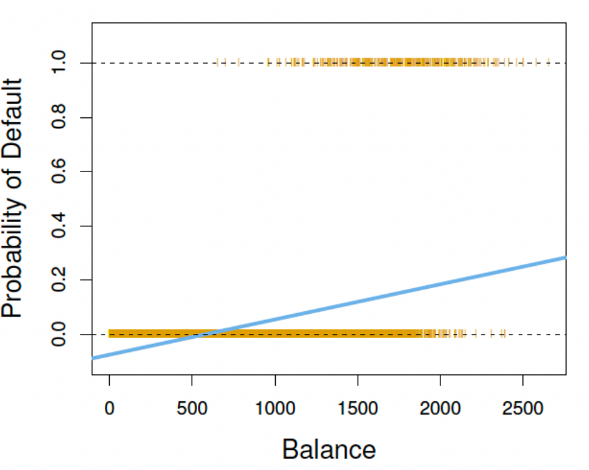

# Classfication and the Logistic Model

## Machine Learning Models
- Supervised learning
    - Input-output mapping (there are X and Y in the data)
    - most widely used in economic/finance-related research
    - Example: classification and regression --> the main focus of subjects this course covers.

- Unsupervised learning
    -No outputs, only inputs (there is only X in the data)
    - the goal is to find interesting patterns in the data and there are no desired outputs given a set of inputs
    - example: cluster analysis, topics extraction (textual analysis), etc.

- Reinforcement learning
    - involving an agent interacting with an environment, which provides reward signals
    - examples: robot navigation, gaming, etc.

## Supervised Learning
Some jargon we will often encounter in ML Literature
- The dataset: $D = \{y_t, X_t\}^T_{t - 1}$
- Denote $$f(X_t, \theta)$$ the mapping function, where $\theta$ is the vector of model parameters.
- Empirical Risk $R$ and Loss function $L$:
    - $R(D, \theta) = \frac{1}{T} \sum_{t = 1}^T L(y_t, f(x_t, \theta))$
    - Estimation/optimization/learning:
        $$\hat{\theta} = argmin_{\theta} R(D, \theta)$$

## Classification
- Very often, the response variable is not a continuous numerical variable. For example, we want to estimate a stock's price is going ot move up or down the next trading day; or we are interested in predicting whether a client would default on a loan or not. In this case, response variable $Y \in \{0, 1\}$ (a binary variable).
- Given a feature vector $X$ and a binary response $Y$, the classification task is to build a function $C(X)$ that maps to the response variable $Y$.
- Often we are more interested in estimating the probabilities that $C(X)$ belongs to each category, i.e. $\{0, 1\}$.

### Example: Credit Card Default

#### Modelling Credit Card Default
Suppose
$$Y = \begin{cases}
   0 &\text{if } No \\
   1 &\text{if } Yes
\end{cases}$$

Can we simply perform a linear regression of $Y$ on $X$ and classify as 'Yes' if $\hat{Y} > 0.5$?
- To some extent, it does the job for classification since we can make a prediction on $Y$ given $X$.
- However, the sensitivity of a change in X to Y is the same along the real line (ideally, we want it to be more in the middle and less sensitive at two ends). Furthermore, we are likely to produce probabilities below zero and larger than 1.

Suppose we are using an OLS regression Model

## Logistic Regression
Let's denote $p(X) = Pr(Y = 1 | X)$ for convenience. Consider the model using 'balance' to predict 'default'. Logistic regression uses the form
$$p(X) = \frac{e^{\beta_0 + \beta_1 X}}{1 + e^{\beta_0 + \beta_1 X}}$$

It is easy to see that the value of $p(X)$ is always restricted between 0 and 1 regardless of the values of $\beta_0$, $\beta_1$, and $X$.

## Logistic Regression for Classification
Logistic regression is a better alternative for this task.

The orange marks indicate the response $Y$, either 0 or 1. Linear regression does not estimate $Pr(Y = 1 | X)$ well. Logistic regression does the job much better.

- You may think there is a connection between the logistic and OLS models.
- Rearranging the previous equation, we obtain
$$log(\frac{p(X)}{1 - p(X)}) = \beta_0 + \beta_1 X$$
We call this the _logit transformation_ of $p(X)$.
- We can use the 'fitglm' function from Matlab (setting 'distribution' parameter to 'binomial') to estimate a logistic model (more details in the tutorial).

## Evaluate Model Performance
- We may use various models to evaluate the relations between $X$ and $Y$, or we want to predict $Y$ given $X$. How do we decide which model performs best?
- From the OLS model, we learned that $R^2$ is a measure of goodness of fit. However, it is an in-sample measure. Usually, we are more interested in out-of-sample measures.
- Technically, we use in-sample data to estimate a model and obtain the model parameters. Then, we use out-of-sample to evaluate the performance of such estimated model.
- In econometric terminology, we call these data samples 'in-sample' and 'out-of-sample' data; whereas in machine learning, they are often referred to as 'training' and 'testing' samples.

### Confusion Matrix
- In case of binary classification problems, confusion matrices are commonly used to compare models.
After estimating the model using the training sample and obtained model parameters, we can then predict $Y$ given $X$ in the testing sample. The model would predict $\hat{Y}$, then we can compare $\hat{Y}$ with $Y$.
- Depending on the pairwise values between $Y$ and $\hat{Y}$, we have the following four types:

- Some important measures
    - True Positive Rate (TPR): $TPR = \frac{TP}{TP + FN}$
    - True Negative Rate (TNR): $TNR = \frac{TN}{TN + FP}$
    - False Discovery Rate (FDR): $FDR = \frac{FP}{FP + TP}$
    - Accuracy: $ACC = \frac{TP + TN}{P + N}$

## Example: Predict Bank Churners
- A bank wants to understand what caused customers to leave (i.e. customers stop transactions with an entity.)
- In the dataset, you are given three possible predictors.
- Use the logistic model and the OLS (as a benchmark) for predicting churners.
- We split the whole sample into training and testing samples. Using the training sample to evaluate a model while using the testing sample for gauging model accuracy.

### Histogram of Each Variable
